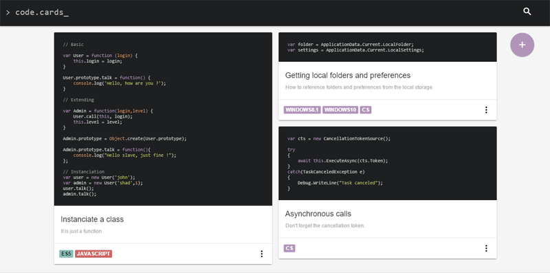

Host your code examples in one centralized place and share it with your team.

## Install

```sh
$ npm install -g code-cards
```

## Usage

```sh
$ code-cards start
```

You can then open your browser and fo to `http://localhost:5555/`.

For managing your cards through the API these methods are availables :

* **GET** `/api/cards[?tags=tag1,tag2,tag3,...]` : gets all the cards filtered by tags.
* **POST** `/api/cards` : creates a new card
* **POST** `/api/cards/:id` : updates a specific card
* **GET** `/api/cards/:id` : gets a specific card
* **DELETE** `/api/cards/:id` : deletes a specific card

## Why ?

There's plenties of other solutions like Github's gists, but I wanted a private place for me and my team members ... but the main purpose of this project was to *try out* new frameworks :

* [Vue.js](https://github.com/yyx990803/vue) : simple javascript frontend framework
* [Material Design Light](https://github.com/google/material-design-lite) : google material design components in JS/CSS
* [highlight.js](https://github.com/isagalaev/highlight.js) : code snippet highlighting
* [webpack](https://github.com/webpack/webpack) : a bundler tool
* [tingodb](https://github.com/sergeyksv/tingodb) : an embedded database compatible with mongo
* [minigrid](https://github.com/henriquea/minigrid) : small library for cascading grid layout

In addition to the frameworks I already **love** :

* [Koa](https://github.com/koajs/koa) : a modern middleware for node using generators
* [commander.js](https://github.com/tj/commander.js) : a command-line interface helper

## Roadmap / ideas

* Add tag auto-completion
* Add pagination
* Add user authentication and rights
* Add compatibility with MongoDB for larger scale usage
* Document source code
* Create IDE plugins
* Clean source code

## Copyright and license

MIT © [Aloïs Deniel](http://aloisdeniel.github.io)
